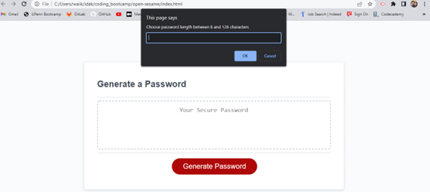
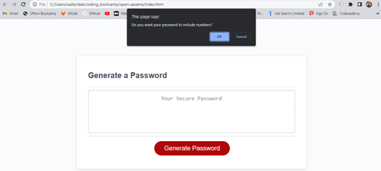

# Open-Sesame

## Description

Deployed URL: ("https://idakukimiya.github.io/open-sesame/")

GitHub URL: ("https://github.com/idakukimiya/open-sesame")

Tasks

* Read requirements 3-5 times

* List questions to ask

* Make a list of items to research

* Get questions answerwed

* Do research

* Break down app into smaller problems

* Choose problem to start with

* Pseudocode the problem

* Code the problem

* Debug the problem

* Choose next problem and repeat steps

* Deploy the app

* Test the deployed app using the links i will submit

* Create a professional readme

Research

* How do I check the user entered length? (Hint: use conditional)

* How do I use Math.random() to pick a random letter?

* How to randomly select from a specific group of characters? (e.g. upper vs lower)

* ("https://w3collective.com/random-password-generator-javascript/")

Steps

DECLARE VARS
string password (the result)
num passLength (user input)
bool useUpper (user input)
bool useLower (user input)
bool useSpecial (user input)
bool useNumber (user input)
arr lowerChars
arr upperChars
arr specialChars
arr numChars
arr choices (array containing all characters chosen by the user)

PROMPT user for password length

CONFIRM if user
would like lower case
IF user would like lower case
THEN add all lowerChars to choices

CONFIRM if user would like upper case

CONFIRM if user would like special characters

CONFIRM if user would like numbers
